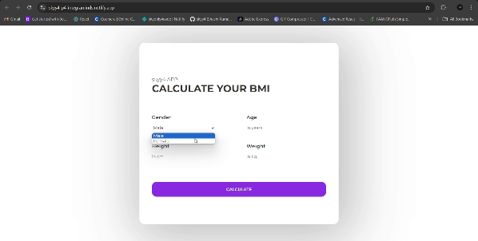

# bmiCalculator Repository
This repository contains bmiCalculator that were developed by me during the Full-Stack bootCamp by INTEGRAMINDS.

# Project
<a href="https://skyy4-p4-integraminds.netlify.app">bmiCalculator</a>
 

# Installation
To use these projects, simply clone or download the repository to your local machine:

git clone https://github.com/skyy4/IntegraMinds-F.Stack-Bootcamp

  
# Usage
Each project is contained within its own folder. To view the project, simply open the index.html file in your web browser. The CSS and JavaScript files are also included within the project folder.
# Contributing
If you would like to contribute to this repository, feel free to submit a pull request or open an issue. We welcome contributions from the community to make these projects even better! 
